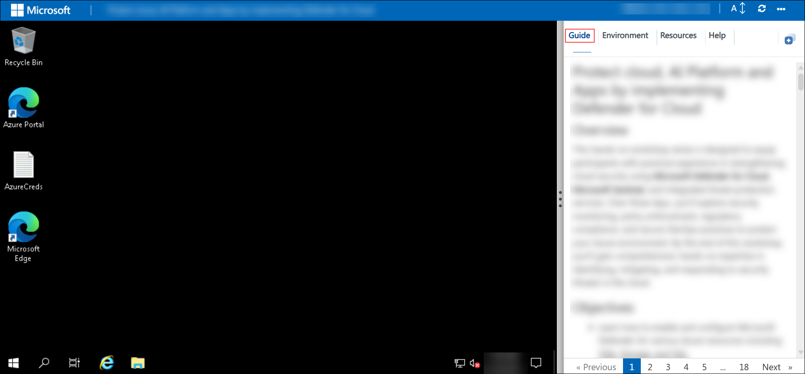

# Empower Knowledge Workers using Azure OpenAI with MS Teams and Azure Bot Service

### Overall Estimated Duration: 60 minutes

## Overview

In this lab, you will explore how to empower knowledge workers by integrating Azure OpenAI with a Microsoft Teams Bot for IT Service Management (ITSM). You will begin by leveraging an OpenAI model to extract data and create embeddings by installing necessary packages and running a Python notebook in Azure Machine Learning Studio. Through hands-on tasks, you will deploy the OpenAI model, configure credentials, and experiment with notebooks, gaining practical experience in data exploration and embedding creation.

## Objective

Learn to leverage an OpenAI model to extract data and create embeddings, by end of this lab you will be able to:

- **Leveraging an OpenAI model to create extract data and create embeddings:** Use an OpenAI model to extract data and create embeddings for advanced data processing and retrieval. Participants will learn to extract data and create embeddings using an OpenAI model for advanced data analysis.

## Prerequisites

Participants should have:

- **Knowledge of Azure Machine Learning Studio**: Familiarity with deploying and working in Azure ML Studio.
- **Basic Python Programming Skills**: Ability to run Python notebooks and update configuration files.
- **Experience with OpenAI Models**: Understanding of OpenAI's capabilities, such as generating embeddings and processing data.

## Architecture

The architecture integrates Azure OpenAI Service with Azure Machine Learning Studio to create embeddings for ITSM applications. Data is processed through Python notebooks in Azure ML Studio, which deploys the OpenAI model for embedding creation. The embeddings are then used to enhance ITSM workflows in applications like Microsoft Teams Bot, ensuring efficient knowledge retrieval and interaction.

## Architecture Diagram

## Explanation of Components

The architecture for this lab involves the following key components:

- **Azure OpenAI Service**: Provides powerful AI models for generating embeddings and analyzing data for ITSM use cases.
- **Azure Machine Learning Studio**: A platform for running Python notebooks, managing libraries, and deploying the OpenAI model.
- **Python Notebooks**: Used for experimenting with data and generating embeddings by running pre-configured scripts.
- **Requirements File**: Lists the necessary libraries and dependencies for seamless execution of Python notebooks.

## Getting Started with the Lab Environment

## Accessing Your Lab Environment

Once you're ready to begin, your virtual machine and lab guide will be available directly within your web browser.

## Virtual Machine & Lab Guide

The virtual machine provides access to the Azure Portal and Microsoft security portals.  
The lab guide remains visible throughout the lab exercises.

## Exploring Your Lab Resources

Navigate to the **Environment** tab to review lab resources and credentials.

## Utilizing the Split Window Feature

Use the **Split Window** button in the top-right corner to open the lab guide in a separate window for easier navigation.

## Managing Your Virtual Machine

Start, stop, or restart your virtual machine as needed from the **Resources** tab.

## Lab Guide Zoom In / Zoom Out

Adjust the zoom level using the **A↕ : 100%** icon located next to the timer.

## Let's Get Started with Azure Portal

1. On the virtual machine, click the **Azure Portal** icon:

    

1. On the **Sign in to Microsoft Azure** page, enter:

   - **Email/Username:** <inject key="AzureAdUserEmail" enableCopy="true"/>

       

1. Enter the password:

   - **Password:** <inject key="AzureAdUserPassword" enableCopy="true"/>

      

1. Select **No** when prompted to stay signed in.

   

## Support Contact

CloudLabs support is available 24/7 to assist learners and instructors.

- **Email:** cloudlabs-support@spektrasystems.com  
- **Live Chat:** https://cloudlabs.ai/labs-support  

Now, click on **Next** from the lower right corner to move on to the next page. 

### Happy Learning!!